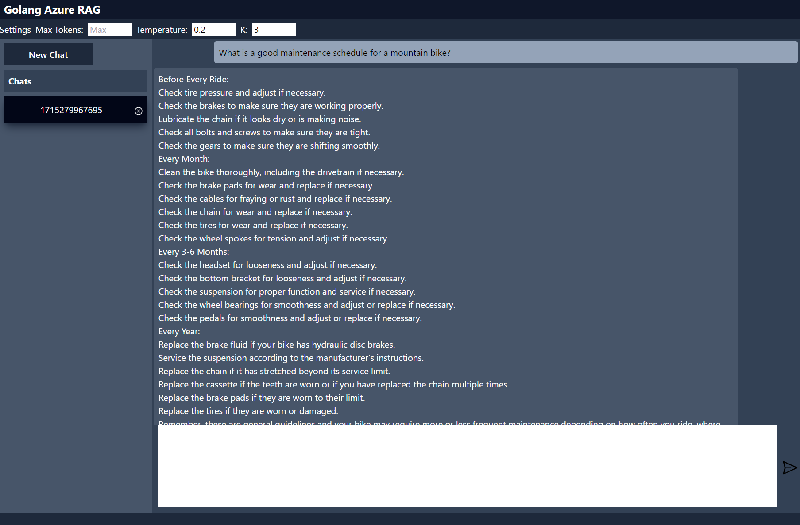

# Azure Golang RAG

A Golang Azure OpenAI and AI Search RAG implementation.

## Objective

To showcase a RAG application written in Go leveraging Azure OpenAI and Azure AI Searcy.

## AI Search

Reference:
- [Integrated Vectorization](https://learn.microsoft.com/en-us/azure/search/vector-search-integrated-vectorization)
- [Semantic Ranking](https://learn.microsoft.com/en-us/azure/search/semantic-search-overview)

## Foundational concepts

- Calling Azure OpenAI using REST
- Calling Azure AI Search using REST
- Semantic Search in AI Search
- Using content as part of the RAG response
- Thread (conversation) management

## Backend

- Go 1.22
- Gin
- godotenv

## Frontend

- SolidJs
- solidjs-icons
- axios

## Running locally

- type: `make run-ui`
- Open a brower at: `http://localhost:8080`
